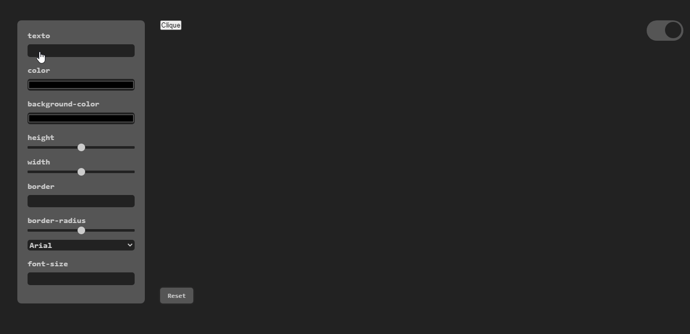
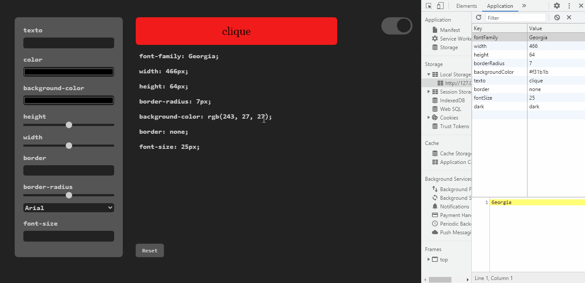

# Button Style Preview
</img>

## Funcionalidades:
+ Pega os valores dos input 
+ Seta os valores no Css do Button 
+ Mostrar valores na Timeline  
+ Aloca os valores na memoria do Localstorage 
+ Style Dark 

## Tecnologias:

+ Html
+ Css
+ javascript

## Style Css:
<pre>
background: #CCC;
background: #eee;
color: #000;

Dark 
background: #222;
background: #555;
color:#ccc;

display: grid;
</pre>

### Observaçao:
<pre>Para melhor funcionalidade da aplicaçao, deve se estar conectado com um micro-servidor.
Live-Server é um exemplo. </pre>
